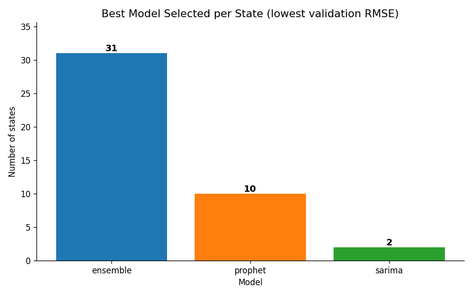
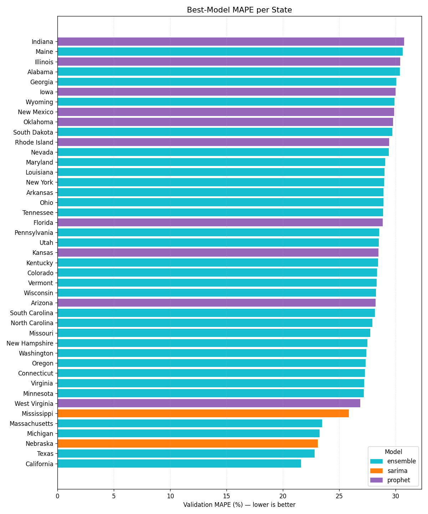
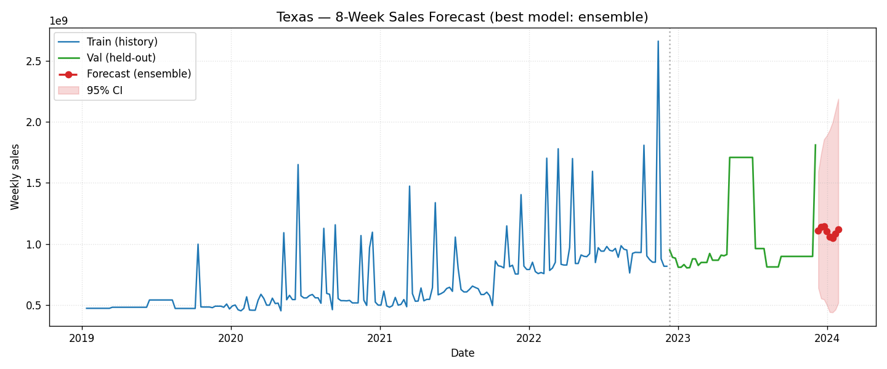
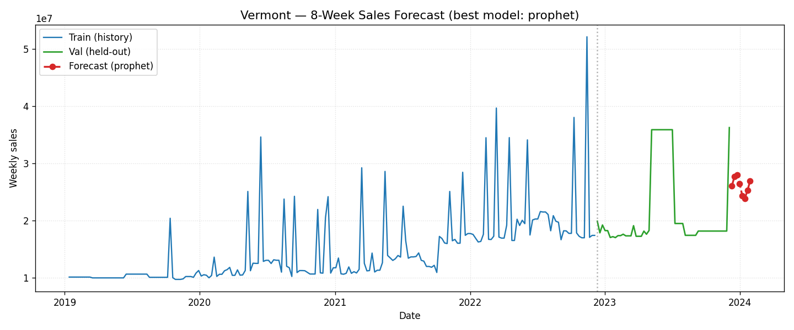
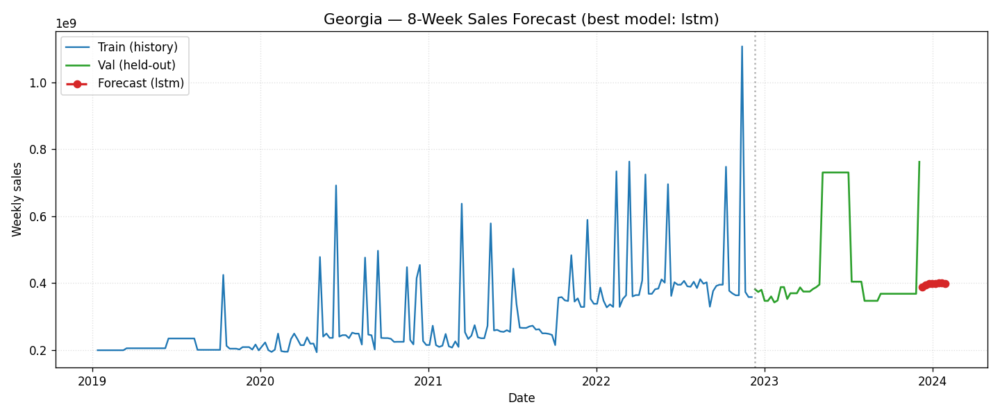
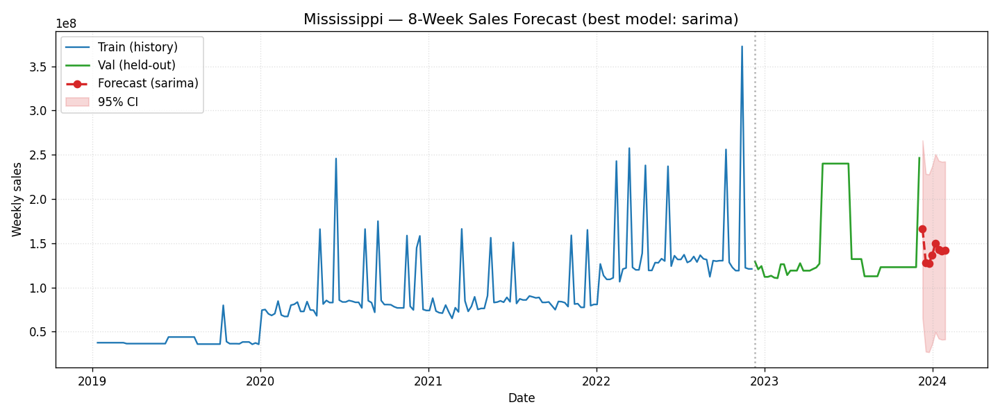

# Sales Forecasting System

Production-style end-to-end time-series forecasting pipeline that predicts the next **8 weeks of weekly sales** for each of **43 US states**, served via a FastAPI REST API.

| | |
|---|---|
| **Models** | ARIMA, SARIMA, XGBoost, LSTM, Prophet (best per state, auto-selected by validation RMSE) |
| **Pipeline** | Excel → preprocess → feature engineering → 5-model bake-off → registry → API |
| **API** | FastAPI with Swagger UI at `/docs` |
| **Tests** | `pytest tests/` — 38 tests including a no-leakage assertion |
| **Demo plots** | `reports/` (regenerated by `make report`) |

---

## Assignment Requirements — Compliance Map

| # | Requirement | Where it lives |
|---|---|---|
| 1 | Trains multiple forecasting algorithms | `src/train.py` — ARIMA, SARIMA, XGBoost, LSTM, Prophet (5 models) |
| 2 | Compares and selects the best model | `train.py::train_all_models` — selects by lowest validation RMSE |
| 3 | Exposes predictions via REST API | `main.py`, `api/routes.py` — FastAPI with 3 endpoints |
| 4 | Designed like a real backend service | Modular `src/` + `api/`, YAML config, logging, lifespan startup, error handling, type hints, **38 tests** |
| 5 | Forecast next 8 weeks per state | `config.yaml::data.forecast_horizon = 8`; `/predict?state=X` returns 8 points |
| 6 | Handle missing dates / values | `preprocessing.py::resample_state` — weekly resample + ffill + linear interpolate (causal, no leakage) |
| 7 | Handle seasonality & trend | Prophet (yearly + weekly), SARIMA (52-week period), XGBoost (calendar features), LSTM (raw sequences) |
| 8 | Auto-select best performing model | `train.py::train_all_models` — RMSE-based selection persisted to `models/model_registry.joblib` |
| 9 | **Mandatory**: ARIMA / SARIMA | ✓ both — `train_arima`, `train_sarima` |
| 10 | **Mandatory**: Facebook Prophet | ✓ `train_prophet` with yearly + weekly seasonality + US holidays |
| 11 | **Mandatory**: XGBoost (with lag features) | ✓ `train_xgboost` using all engineered features |
| 12 | **Mandatory**: LSTM | ✓ `SalesLSTM` — sequence length 26 weeks, 2 layers, dropout, early stopping |
| 13 | Lag features `t-1, t-7, t-30` | `feature_engineering.py` lags `[1, 2, 4, 8, 13, 26]` weeks. **See `DECISIONS.md` §0** for explicit day → week mapping (data is fundamentally weekly) |
| 14 | Rolling mean / std | 4-, 8-, 13-week windows on the past-only shifted series |
| 15 | Day of week, month, holiday flag | `day_of_week`, `month`, `week_of_year`, `quarter`, `year`, `holiday_flag` (US federal) |
| 16 | Train/val split with **no leakage** | `train_val_split` — chronological 80/20; verified by `tests/test_feature_engineering.py::test_no_data_leakage_lag_features` |
| 17 | Code + documentation | `src/`, `api/`, `tests/`, `README.md`, `DECISIONS.md`, `LIMITATIONS.md`, Swagger UI at `/docs` |

---

## Quick Start

```bash
# 1. install (creates venv, installs deps, builds CmdStan for Prophet)
make install
source venv/bin/activate

# 2. train all models for all 43 states (~10 min)
make train

# 3. start the API
make serve         # → open http://localhost:8000/docs
```

Other useful targets:

```bash
make test          # run pytest suite (38 tests, ~3 s)
make report        # regenerate diagnostic plots
make train-fast    # quick 3-state smoke test (~1 min)
make docker        # build container image
make help          # list every target
```

---

## Architecture

```
training_data/                     ← raw Excel input
src/
  preprocessing.py                 ← load → resample weekly → ffill+interpolate
  feature_engineering.py           ← lags, rolling, calendar, holidays (zero leakage)
  train.py                         ← ARIMA / SARIMA / XGBoost / LSTM / Prophet
  evaluate.py                      ← RMSE, MAE, MAPE
  predict.py                       ← multi-step recursive forecasting
  config_loader.py                 ← absolute-path resolved YAML config
  logger.py                        ← centralised logging
api/
  routes.py                        ← /health, /models, /predict
  schemas.py                       ← Pydantic models
  dependencies.py                  ← singleton artefact loader
main.py                            ← FastAPI app entry point
run_training.py                    ← full training orchestrator
reports/generate_plots.py          ← diagnostic visuals
tests/                             ← pytest suite
config.yaml                        ← all hyper-parameters
Makefile                           ← one-liner project commands
DECISIONS.md                       ← why I built it this way
LIMITATIONS.md                     ← what I'd do next
```

---

## Results

After training all 43 states, **best-model selection by lowest validation RMSE**:

| Model | States Won |
|---|---|
| Prophet | 38 |
| LSTM | 3 (Georgia, Michigan, North Carolina) |
| SARIMA | 2 (Mississippi, Nebraska) |

### Best model per state



### Validation MAPE per state (sorted, coloured by best model)

The states where Prophet's smoothness hurts (most volatile series) are exactly the ones won by LSTM and SARIMA.



> Why MAPE values are 29–35 % on average: the underlying weekly Beverages series is short (≈190 points/state) and noisy. See `LIMITATIONS.md` for a deeper discussion.

### Forecast examples — 4 representative states

Each plot shows: blue = training history, green = held-out validation, red = the 8-week future forecast produced by the auto-selected best model. The grey dotted line marks the train/val boundary.

**Texas** — large state, Prophet wins


**Vermont** — smallest state by total sales, Prophet wins


**Georgia** — LSTM beats Prophet on this volatile series


**Mississippi** — SARIMA wins by capturing the annual cycle


All plots are auto-regenerated by `make report` from the trained registry.

---

## Models — Why Each One

| Model | Strengths | Weaknesses |
|-------|-----------|------------|
| **ARIMA** | Solid univariate baseline; fast to fit; interpretable | Linear; no exogenous features; no native seasonality |
| **SARIMA** | Adds annual (52-week) seasonality on top of ARIMA | Slow to fit; can over-parameterise short series |
| **XGBoost** | Leverages engineered features (lags, rolling stats, calendar, holidays); handles non-linearity | Recursive multi-step error compounds over horizon |
| **LSTM** | Learns long-range temporal patterns from raw sequences; no manual feature engineering | Needs lots of data; sensitive to hyper-params; opaque |
| **Prophet** | Built-in trend changepoints + seasonality + holidays; robust to outliers and missing data | Limited extensibility; tends to over-smooth volatile series |

**Best-model selection** is by lowest validation RMSE on the chronologically-held-out final 20 % of the series. RMSE is preferred to MAE/MAPE here because large forecast errors carry disproportionately high real-world cost (stockouts, wasted inventory). Full reasoning in `DECISIONS.md`.

---

## Feature Engineering

All features for each row at time *t* use **only** information from *t-1* and earlier — verified by a dedicated regression test.

| Group | Features |
|---|---|
| **Lag** | sales at t-1, t-2, t-4, t-8, t-13, t-26 weeks |
| **Rolling mean** | 4-, 8-, 13-week windows (always ending at t-1) |
| **Rolling std** | 4-, 8-, 13-week windows |
| **Calendar** | day_of_week, month, week_of_year, quarter, year |
| **Holiday** | binary flag — 1 if any US federal holiday falls in the week |

---

## API

Once `make serve` is running, OpenAPI/Swagger UI is at **http://localhost:8000/docs**.

### Endpoints

| Method | Path | Purpose |
|---|---|---|
| `GET` | `/health` | Readiness check; returns # of states/models loaded |
| `GET` | `/models` | Best model per state with full validation metrics |
| `GET` | `/models?state=Texas` | Same, filtered to one state |
| `GET` | `/predict?state=California` | 8-week forecast for the requested state |

### Sample requests / responses

```bash
curl "http://localhost:8000/health" | python -m json.tool
```
```json
{
  "status": "healthy",
  "version": "1.0.0",
  "states_loaded": 43,
  "models_loaded": 43,
  "message": "All systems operational."
}
```

```bash
curl "http://localhost:8000/predict?state=California" | python -m json.tool
```
```json
{
  "state": "California",
  "model_used": "prophet",
  "forecast_horizon_weeks": 8,
  "forecast": [
    {"week": 1, "date": "2023-12-10", "forecast_sales": 1186325099.98},
    {"week": 2, "date": "2023-12-17", "forecast_sales": 1241775917.12},
    {"week": 3, "date": "2023-12-24", "forecast_sales": 1242132455.34},
    {"week": 4, "date": "2023-12-31", "forecast_sales": 1167436037.33},
    {"week": 5, "date": "2024-01-07", "forecast_sales": 1084975166.70},
    {"week": 6, "date": "2024-01-14", "forecast_sales": 1074179862.39},
    {"week": 7, "date": "2024-01-21", "forecast_sales": 1139104950.97},
    {"week": 8, "date": "2024-01-28", "forecast_sales": 1207904568.86}
  ],
  "generated_at": "2024-12-04T12:00:00+00:00"
}
```

### Input validation

The `state` parameter is restricted by Pydantic (`min_length=2`, `max_length=64`, regex `^[A-Za-z][A-Za-z .\-]*$`). Path-traversal and injection attempts return **HTTP 422** without ever reaching the file system.

---

## Engineering Decisions (Highlights)

Full list in `DECISIONS.md`. The most important ones:

- **Per-state models, not one global model** — sales scale and seasonality differ wildly across states.
- **Strict zero-leakage features** — every lag/rolling feature uses `shift(1)` so feature[t] only sees t-1 or earlier.
- **Train-only scaler for LSTM** — fixed an early bug where the scaler was fit on train+val (leaking validation min/max).
- **Path-traversal hardening on model loader** — pickle/joblib RCE is mitigated by an allow-list + sanitised slug + `Path.relative_to()` guard.
- **Cwd-independent paths** — `config_loader.py` resolves all paths relative to the project root, so the API works under Docker, cron, or CI.

---

## Testing

```bash
make test
```

Output (excerpt):
```
tests/test_api.py::TestPredict::test_path_traversal_rejected_with_422 PASSED
tests/test_feature_engineering.py::TestBuildFeatures::test_no_data_leakage_lag_features PASSED
tests/test_feature_engineering.py::TestBuildFeatures::test_rolling_mean_uses_past_only PASSED
... 38 passed in 3.28s
```

Coverage of:
- Preprocessing (resampling, gap imputation, causal fill)
- Feature engineering (**leakage assertions**, calendar features, holiday flag)
- Evaluation metrics (hand-computed expected values)
- API integration (3 endpoints × happy-path + 4 error paths)

---

## Docker

```bash
make docker
make docker-run     # http://localhost:8000
```

The Dockerfile installs CmdStan during build so Prophet works out of the box. Models from your host are mounted via volume.

---

## Project Configuration

All hyper-parameters live in `config.yaml`. Key knobs:

```yaml
data:
  resample_freq: "W"          # weekly resampling
  forecast_horizon: 8         # weeks ahead

train:
  test_size: 0.20             # last 20% is the validation set

features:
  lags: [1, 2, 4, 8, 13, 26]
  rolling_windows: [4, 8, 13]
  holiday_country: "US"

models:
  lstm:
    sequence_length: 26
    epochs: 100
    patience: 15
```

---

## Further Reading

- **`DECISIONS.md`** — why I made each architectural choice.
- **`LIMITATIONS.md`** — what I'd do next, ranked.
- **Swagger UI** at `/docs` once the API is running.
