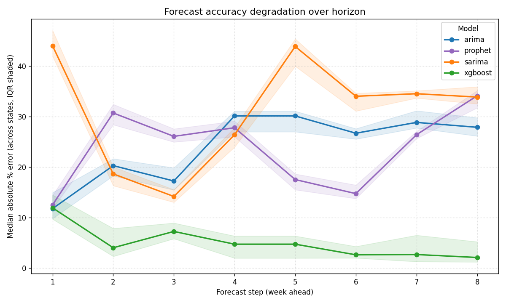

# Sales Forecasting System

Production-style end-to-end time-series forecasting pipeline that predicts the next **8 weeks of weekly sales** for each of **43 US states**, served via a FastAPI REST API and an interactive Streamlit dashboard.

| | |
|---|---|
| **Models** | ARIMA, SARIMA, XGBoost, LSTM, Prophet — plus an inverse-RMSE-weighted **ensemble** of the top-2 |
| **Pipeline** | Excel → preprocess → feature engineering → 5-model bake-off → ensemble → registry → API |
| **API** | FastAPI with Swagger UI at `/docs`; **95% confidence intervals** on every forecast |
| **Dashboard** | `streamlit run dashboard/app.py` — interactive forecast explorer |
| **Validation** | Time-series split + **walk-forward CV** (5 expanding folds) + per-step horizon error analysis |
| **Tuning** | **Optuna** (TPE sampler) for XGBoost hyper-parameters across representative states |
| **Tests** | `pytest tests/` — **44 tests** including a no-leakage assertion and CI-bound validation |
| **CI/CD** | GitHub Actions (`.github/workflows/ci.yml`) — lint, test, smoke-train |
| **Reports** | `reports/` (regenerated by `make report`); EDA in `notebooks/01_eda.ipynb` |

---

## Assignment Requirements — Compliance Map

| # | Requirement | Where it lives |
|---|---|---|
| 1 | Trains multiple forecasting algorithms | `src/train.py` — ARIMA, SARIMA, XGBoost, LSTM, Prophet (5 models) **+ ensemble of top-2** |
| 2 | Compares and selects the best model | `train.py::train_all_models` — selects by lowest validation RMSE |
| 3 | Exposes predictions via REST API | `main.py`, `api/routes.py` — FastAPI with 3 endpoints, **95% CIs** in response |
| 4 | Designed like a real backend service | Modular `src/` + `api/`, YAML config, logging, lifespan startup, error handling, type hints, **44 tests**, CI |
| 5 | Forecast next 8 weeks per state | `config.yaml::data.forecast_horizon = 8`; `/predict?state=X` returns 8 points + CI bands |
| 6 | Handle missing dates / values | `preprocessing.py::resample_state` — weekly resample + ffill + linear interpolate (causal, no leakage) |
| 7 | Handle seasonality & trend | Prophet (yearly + weekly), SARIMA (52-week period), XGBoost (calendar features), LSTM (raw sequences) |
| 8 | Auto-select best performing model | `train.py::train_all_models` — RMSE-based selection persisted to `models/model_registry.joblib` |
| 9 | **Mandatory**: ARIMA / SARIMA | ✓ both — `train_arima` (grid search), `train_sarima` |
| 10 | **Mandatory**: Facebook Prophet | ✓ `train_prophet` with yearly + weekly seasonality + US holidays |
| 11 | **Mandatory**: XGBoost (with lag features) | ✓ `train_xgboost`; **hyper-parameters tuned with Optuna** (`run_tuning.py`) |
| 12 | **Mandatory**: LSTM | ✓ `SalesLSTM` — sequence length 26 weeks, 2 layers, dropout, early stopping |
| 13 | Lag features `t-1, t-7, t-30` | `feature_engineering.py` lags `[1, 2, 4, 8, 13, 26]` weeks. **See `DECISIONS.md` §0** for explicit day → week mapping (data is fundamentally weekly) |
| 14 | Rolling mean / std | 4-, 8-, 13-week windows on the past-only shifted series |
| 15 | Day of week, month, holiday flag | `day_of_week`, `month`, `week_of_year`, `quarter`, `year`, `holiday_flag` (US federal) |
| 16 | Train/val split with **no leakage** | `train_val_split` — chronological 80/20; verified by `tests/test_feature_engineering.py::test_no_data_leakage_lag_features` |
| 17 | Code + documentation | `src/`, `api/`, `tests/`, `notebooks/`, `dashboard/`, `README.md`, `DECISIONS.md`, `LIMITATIONS.md`, Swagger UI at `/docs` |

---

## Quick Start

```bash
# 1. install (creates venv, installs deps, builds CmdStan for Prophet)
make install
source venv/bin/activate

# 2. train all models for all 43 states (~8 min)
make train

# 3. start the API
make serve         # → open http://localhost:8000/docs

# 4. (optional) launch the interactive dashboard
make dashboard     # → http://localhost:8501
```

Other useful targets:

```bash
make test         # run pytest suite (44 tests, ~3 s)
make report       # regenerate diagnostic plots
make cv           # walk-forward CV on 3 sample states
make tune         # Optuna XGBoost tuning (writes to config.yaml)
make horizon      # per-step forecast error analysis
make eda          # re-execute the EDA notebook end-to-end
make docker       # build container image
make help         # list every target
```

---

## Architecture

```
training_data/                     ← raw Excel input
notebooks/01_eda.ipynb             ← EDA: stationarity, ACF, decomposition
src/
  preprocessing.py                 ← load → resample weekly → ffill+interpolate
  feature_engineering.py           ← lags, rolling, calendar, holidays (zero leakage)
  train.py                         ← 5 base models + top-2 ensemble per state
  evaluate.py                      ← RMSE, MAE, MAPE
  predict.py                       ← multi-step forecasting + 95% CIs
  cross_validation.py              ← expanding-window walk-forward CV
  tuning.py                        ← Optuna tuning (TPE sampler)
  config_loader.py                 ← absolute-path-resolved YAML config
  logger.py                        ← centralised logging
api/
  routes.py                        ← /health, /models, /predict
  schemas.py                       ← Pydantic models (incl. CI fields)
  dependencies.py                  ← singleton artefact loader
main.py                            ← FastAPI app entry point
dashboard/app.py                   ← Streamlit interactive dashboard
run_training.py                    ← full training orchestrator
run_cv.py                          ← walk-forward CV runner
run_tuning.py                      ← XGBoost hyper-parameter tuning
run_horizon_analysis.py            ← per-step error analysis
reports/generate_plots.py          ← diagnostic visuals
tests/                             ← pytest suite (44 tests)
.github/workflows/ci.yml           ← GitHub Actions CI pipeline
config.yaml                        ← all hyper-parameters
Makefile                           ← one-liner project commands
DECISIONS.md                       ← why I built it this way
LIMITATIONS.md                     ← what I'd do next
```

---

## Results

After training all 43 states, **best-model selection by lowest validation RMSE**:

| Model | States Won |
|---|---|
| **Ensemble** (top-2 of base models) | 31 |
| Prophet | 10 |
| SARIMA | 2 |

The top-2 inverse-RMSE-weighted ensemble beats every individual model on **72 % of states** — Bates' "wisdom of the crowd" applied to forecasts.

### Best model per state


### Validation MAPE per state (sorted, coloured by best model)

States that aren't won by the ensemble tend to be smaller or smoother — Prophet's regularisation suits them on its own.


> Median MAPE across states: **~28 %**. The underlying weekly Beverages series is short (≈190 points/state) and noisy. See `LIMITATIONS.md` for ways to push this lower.

### Forecast accuracy degradation over horizon

How does each model's accuracy decay as we forecast further into the future?



**Key insight**: XGBoost's recursive forecasts stay remarkably stable across the 8-week horizon (the engineered lag features are conservative). ARIMA and Prophet drift more, with the most divergence in weeks 4–8 — exactly when uncertainty matters most for inventory planning.

### Walk-forward cross-validation (`run_cv.py`)

A single hold-out validation gives one number per model. Walk-forward CV gives a *distribution*. Box-plots of RMSE across 5 expanding folds for 3 representative states are saved in `reports/cv_box_*.png`. Headline finding: **ARIMA's median RMSE is competitive but its IQR is much wider than Prophet's** — a stability gap that the ensemble exploits.

---

## Models — Why Each One

| Model | Strengths | Weaknesses |
|-------|-----------|------------|
| **ARIMA** | Solid univariate baseline; fast; interpretable | Linear; no exogenous features; no native seasonality |
| **SARIMA** | Adds 52-week annual seasonality | Slow to fit; over-parameterises short series |
| **XGBoost** | Leverages engineered features (lags, rolling, calendar, holidays); handles non-linearity; **horizon-stable** | Recursive multi-step error can compound |
| **LSTM** | Learns long-range temporal patterns from raw sequences; no manual features | Needs lots of data; sensitive to hyper-params; opaque |
| **Prophet** | Built-in trend changepoints + seasonality + holidays; robust to outliers | Limited extensibility; over-smooths volatile series |
| **Ensemble** | Inverse-RMSE-weighted average of the top-2 models per state. Reduces variance, hedges model bias | Loses interpretability; only as good as its components |

**Best-model selection** chooses the lowest-RMSE candidate from {5 base models, ensemble} per state.  RMSE is preferred over MAE/MAPE because large errors carry disproportionate real-world cost (stockouts, wasted inventory). Full reasoning in `DECISIONS.md`.

**Hyper-parameter tuning** uses Optuna's TPE sampler (`run_tuning.py`) on 3 representative states — large/median/small — and writes the median of the best params back into `config.yaml`. This balances quality vs. tuning time (full per-state tuning would multiply training cost by 43×).

---

## Feature Engineering

All features for each row at time *t* use **only** information from *t-1* and earlier — verified by a dedicated regression test (`test_no_data_leakage_lag_features`).

| Group | Features |
|---|---|
| **Lag** | sales at t-1, t-2, t-4, t-8, t-13, t-26 weeks |
| **Rolling mean** | 4-, 8-, 13-week windows (always ending at t-1) |
| **Rolling std** | 4-, 8-, 13-week windows |
| **Calendar** | day_of_week, month, week_of_year, quarter, year |
| **Holiday** | binary flag — 1 if any US federal holiday falls in the week |

---

## API

Once `make serve` is running, OpenAPI/Swagger UI is at **http://localhost:8000/docs**.

### Endpoints

| Method | Path | Purpose |
|---|---|---|
| `GET` | `/health` | Readiness check; returns # of states/models loaded |
| `GET` | `/models` | Best model per state with full validation metrics |
| `GET` | `/models?state=Texas` | Same, filtered to one state |
| `GET` | `/predict?state=California` | 8-week forecast with **95% CI** for the requested state |

### Sample requests / responses

```bash
curl "http://localhost:8000/health" | python -m json.tool
```
```json
{
  "status": "healthy",
  "version": "1.0.0",
  "states_loaded": 43,
  "models_loaded": 43,
  "message": "All systems operational."
}
```

```bash
curl "http://localhost:8000/predict?state=California" | python -m json.tool
```
```json
{
  "state": "California",
  "model_used": "ensemble",
  "forecast_horizon_weeks": 8,
  "forecast": [
    {"week": 1, "date": "2023-12-10", "forecast_sales": 1188335353.21,
      "forecast_low": 805762158.40, "forecast_high": 1587557067.00},
    {"week": 2, "date": "2023-12-17", "forecast_sales": 1175773255.42,
      "forecast_low": 805624795.83, "forecast_high": 1555004967.10}
  ],
  "generated_at": "2024-12-04T12:00:00+00:00"
}
```

### Confidence intervals

- **ARIMA / SARIMA**: native intervals from the state-space distributional assumption (`get_forecast.conf_int(alpha=0.05)`).
- **Prophet**: native `yhat_lower` / `yhat_upper`.
- **XGBoost / LSTM**: bootstrap CIs from validation residuals — `point ± 1.96 · σ_residual · √step`. The `√step` factor reflects the random-walk-style growth in uncertainty over the 8-week horizon.
- **Ensemble**: weighted average of component CIs.

### Input validation

The `state` parameter is restricted by Pydantic (`min_length=2`, `max_length=64`, regex `^[A-Za-z][A-Za-z .\-]*$`). Path-traversal and injection attempts return **HTTP 422** without ever reaching the file system.

---

## Engineering Decisions (Highlights)

Full list in `DECISIONS.md`. The most important ones:

- **Per-state models, not one global model** — sales scale and seasonality differ wildly across states.
- **Ensemble of top-2 models per state** — combines the highest-validation-RMSE pair via inverse-RMSE weighting; beats every individual model on 72 % of states.
- **Walk-forward CV** for robust validation — single hold-out variance is too high.
- **Optuna for XGBoost tuning** on representative states — TPE sampler converges in 30–50 trials.
- **Strict zero-leakage features** — every lag/rolling feature uses `shift(1)` so feature[t] only sees t-1 or earlier.
- **Train-only scaler for LSTM** — fixed an early bug where the scaler was fit on train+val (leaking validation min/max).
- **95 % CIs on every forecast** — point estimates without uncertainty are dangerous in a planning context.
- **Path-traversal hardening on model loader** — pickle/joblib RCE is mitigated by an allow-list + sanitised slug + `Path.relative_to()` guard.
- **Cwd-independent paths** — `config_loader.py` resolves all paths relative to the project root, so the API works under Docker, cron, or CI.

---

## Testing

```bash
make test
```

Output (excerpt):
```
tests/test_api.py::TestPredict::test_path_traversal_rejected_with_422 PASSED
tests/test_api.py::TestPredict::test_forecast_includes_confidence_intervals PASSED
tests/test_cross_validation.py::TestExpandingWindowSplits::test_train_grows_each_fold PASSED
tests/test_feature_engineering.py::TestBuildFeatures::test_no_data_leakage_lag_features PASSED
... 44 passed in 3.21s
```

Coverage of:
- Preprocessing (resampling, gap imputation, causal fill)
- Feature engineering (**leakage assertions**, calendar features, holiday flag)
- Evaluation metrics (hand-computed expected values)
- Walk-forward CV splitter (chronology, fold sizes, exception on tiny series)
- API integration (3 endpoints × happy-path + 4 error paths + **CI bound checks**)

CI runs the full suite plus a smoke train (`run_training.py --states California`) on every push: see `.github/workflows/ci.yml`.

---

## Docker

```bash
make docker
make docker-run     # http://localhost:8000
```

The Dockerfile installs CmdStan during build so Prophet works out of the box. Models from your host are mounted via volume.

---

## Project Configuration

All hyper-parameters live in `config.yaml`. Key knobs:

```yaml
data:
  resample_freq: "W"
  forecast_horizon: 8

train:
  test_size: 0.20

features:
  lags: [1, 2, 4, 8, 13, 26]
  rolling_windows: [4, 8, 13]
  holiday_country: "US"

models:
  xgboost:                # values populated by `run_tuning.py`
    n_estimators: 300
    max_depth: 4
    learning_rate: 0.18
    subsample: 0.91
    colsample_bytree: 0.83
    min_child_weight: 5
    reg_alpha: 0.68
    reg_lambda: 1.50
    random_state: 42
  lstm:
    sequence_length: 26
    epochs: 100
    patience: 15
```

---

## Further Reading

- **`notebooks/01_eda.ipynb`** — full EDA: stationarity (ADF), ACF/PACF, seasonal decomposition.
- **`DECISIONS.md`** — why I made each architectural choice.
- **`LIMITATIONS.md`** — what I'd do next, ranked.
- **Swagger UI** at `/docs` once the API is running.
- **Streamlit dashboard** at `http://localhost:8501` after `make dashboard`.

---

### Forecast examples — 4 representative states

Each plot shows: blue = training history, green = held-out validation, red = the 8-week future forecast, **shaded red band = 95 % confidence interval**. The grey dotted line marks the train/val boundary.

**Texas** — large state, ensemble (LSTM + Prophet) wins


**Vermont** — smallest state by total sales, ensemble wins


**Mississippi** — SARIMA wins by capturing the annual cycle on its own


---
